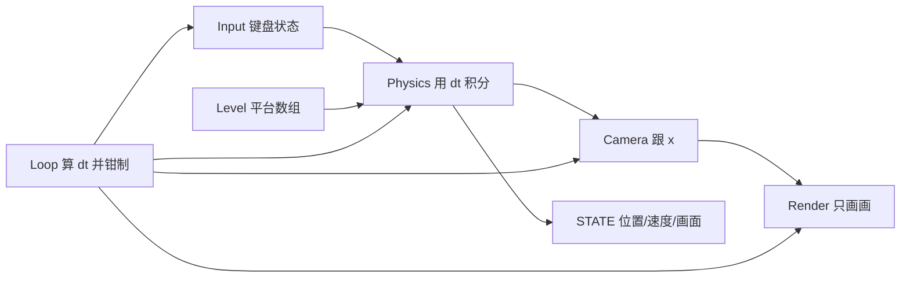

# 夜巷灯笼跑者 — 开发计划

## 目标

做一个能在浏览器里玩的横版跳跃，手感接近大家熟悉的「方向键/A D 移动、空格跳」，视觉是夜巷狸猫，不照搬马里奥配色和造型。

玩家 10–60 岁，没有游戏经验也能在 10 秒内明白怎么玩。重点在画面和手感，不做存档、关卡编辑器。

## 约束

- 只用原生 HTML / CSS / JavaScript，无框架、无库、无构建工具
- 全部代码在 `index.html` 一个文件里
- 渲染用 Canvas 2D；循环用 `requestAnimationFrame`；位移按 `dt`（秒）计算，60Hz 与 144Hz 速度一致
- 可调数值集中在顶部 `CONFIG` 和 `PALETTE`，每一项中文注释写清调大/调小的效果
- 注释一律中文
- 每次改动只做明确要求的那一件事，不顺手重构

## 美术方向 A（已锁定）

**一句话：** 戴斗笠的小狸猫，在雨后霓虹巷的瓦屋顶上连跳。

| 用途 | 键名 | 色值 | 调参提示 |
|------|------|------|----------|
| 夜空 | `sky` | `#0B1020` | 调亮不像夜；调暗平台更难认 |
| 霓虹青 | `neon` | `#2EE6D6` | 招牌、终点；用多了会花 |
| 灯笼橙 | `lantern` | `#FF7A3D` | 斗笠、收集物；画面里的热色 |
| 瓦顶 | `tile` | `#3D4A5C` | 平台主体；必须比夜空亮 |
| 狸毛 | `fur` | `#C48A5A` | 主角；调暗会融进夜空 |

- 主角：圆耳、短尾、斗笠；碰撞用矩形，画在矩形里
- 收集物：小灯笼；终点：亮青光的巷口
- 风险：平台对比不够会踩不准；霓虹只留青和橙两个强调色

## 代码结构（单文件内用注释分块）

| 模块 | 职责 |
|------|------|
| `PALETTE` / `CONFIG` | 颜色与手感数字，不含逻辑 |
| Input | 记录按住/松开，提供 jump 边沿 |
| Level | 平台、出生点、终点、收集物数组 |
| Physics | 重力、移动、AABB、落地 |
| Camera | 只跟 x，可加一点平滑 |
| Render | 清屏、背景、平台、主角、UI |
| Loop | 算 `dt`、钳制 `maxDt`、按序调用 |

数据流：输入 → 改速度 → `dt` 移动 → 撞平台 → 相机跟随 → 按相机偏移绘制。碰撞一律 AABB（视觉可以是瓦片，判定仍是矩形）。

## 步骤与验证

### 步骤 1 — 画布 + 左右移动（已完成）

色块左右移动，`dt` 已接上。验证：D/→ 向右，A/← 向左，松开即停。

### 步骤 2 — 重力、地板、跳跃（已完成）

地板用 `PALETTE.tile`；空格跳起再落下；空中不能连跳，必须落地后再跳。验证：站着空格能跳；空中再按无效；把 `gravity` 调大应更「坠」。

### 步骤 3 — 多平台碰撞（已完成）

地面 + 3～4 块高低平台；先拆 X 再拆 Y 的 AABB，避免撞墙侧面时被弹到墙顶。验证：跳上高台、走到尽头掉下、侧面挡住、无穿模抖动。

### 步骤 4 — 横向关卡 + 摄像机（已完成）

关卡宽于屏幕，相机只跟 x。验证：向右跑时世界左移；跳跃时相机不上下狂晃。

### 步骤 5 — 换皮（已完成）

狸猫剪影 + 瓦屋顶 + 一层视差。验证：3 秒内认出人和落脚点；截图能对上 5 色。

### 步骤 6 — 收集 + 终点（已完成）

3–5 个灯笼，终点巷口，标题「A/D 移动，空格跳跃」，掉出世界底部重生。验证：约 20–40 秒能过关；掉下去会重来。

### 步骤 7 — 手感（已完成）

Coyote Time、跳跃缓冲、落地缩放、少量粒子。验证：离台边缘后立刻按跳仍能跳；落地前预按空格会一落地就跳。

### 步骤 8 — 分享（已完成）

保持 960×540 比例适配窗口。验证：一个 http 链接在另一台电脑用键盘能玩。

## 不在范围内

存档、关卡编辑器、移动端触摸、框架与打包工具、音效库（若加音效用浏览器自带 Web Audio，另开一步）。
